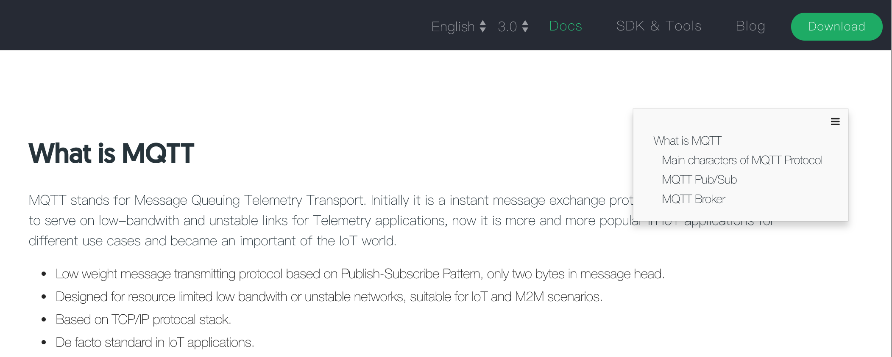

# Preparation

This chapter includes the preparation work before starting to learn this tutorial, it includes following contents, 

- MQTT protocol introduction
- EMQ X prodcts introduction

Reader will have basic knowledge of MQTT protocol and EMQ X products after reading this chapter, and it's important to learn these basis concepts before installing and using EMQ X. 

# Read Guide

Documents are well organized in left navigation menu, and  you can click related link to read it. If mouse is moved to **Contents** icon of right-top corner, table of contents for this document will be displayed, and you can click the title to directly navigate the related anchor. 

