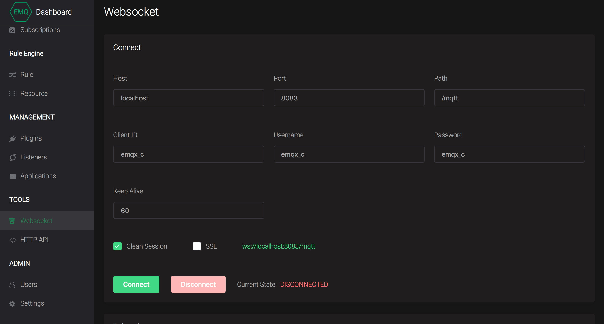
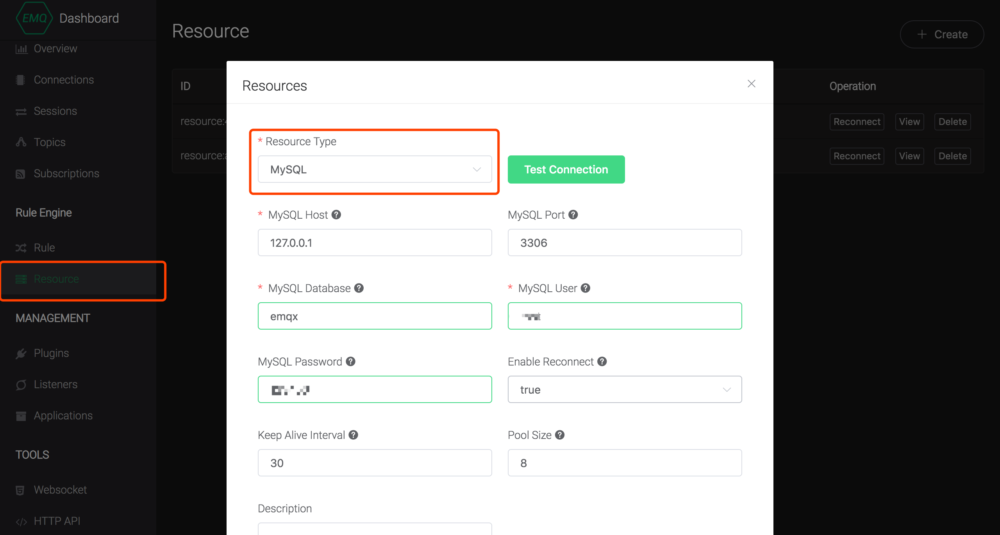
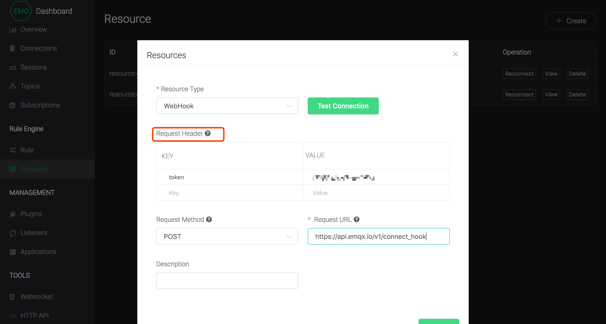
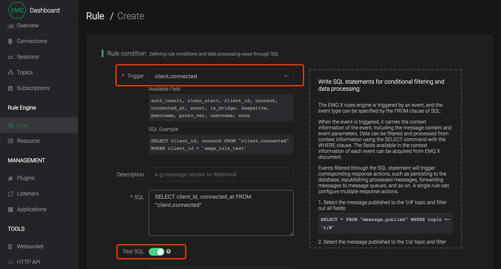

# Configuration examples

> Compatibility tip: The EMQ X v4.0 makes great adjustments to the SQL syntax of the Rule Engine. For v3.x upgrade users, please refer to the [Migration Guide](./ rule_engine.md#migration-guide) for adaptation.

This article provides two examples to demonstrate the creation and use of the rules engine through the dashboard visual interface.


## Example 1: Persist messages to disk/database via Web Server

### Scenario Description

In this scenario, the on-board sensor of the truck from vehicle networking is used to report the following JSON message through the topic of `/monitor/:device_id/state`(device_id is the clientid of the vehicle connection client, the same with vehicle ID):

```js
{
  "speed": 20, // Real-time speed (km/h)
  "lng": 102.8622543812, // Position longitude  
  "lat": 24.8614503916, // Position latitude
  "load": 1200101 // Load capacity (kg)
}
```

Rule engine needs to send data at speeds greater than 60 km/h to Web Server for persistence processing, so as to determine whether speeding occurs in the later period combined with geographical location.

> With consideration of throughput performance and message consistency, it is not enough to  persist device messages by using Web Server . Here is just a rule engine experience example. If you have related scenarios, try the scheme of data bridging or directly persisting to the database.


### Preparation

#### Write HTTP interface to receive and process messages from rule engine

The sample code of this section is as follows:

```js
'use strict'
const http = require('http')
const execSync = require('child_process').execSync
// Initialize global variables for counting
let msg_num = 0
http.createServer((req, res) => {

  const { token } = req.headers
  console.log('message coming', 'token:', token)
  // Simple authentication
  if (!token || token !== 'web_token') {
    return res.end('-1')
  }
  let body = ''
  req.on('data', (data) => {
    body = body + data
  })
  req.on('end', () => {
    body = body.toString()
    try {
      const message = JSON.parse(body)
      // Additional timestamp
      /** @type {number} */
      message.ts = Date.now()
      message.index = msg_num
      // Persist data to disk, actually processed according to business
      execSync(`echo '${JSON.stringify(message)}' >> message.log`)
      msg_num = msg_num + 1
      res.end(msg_num.toString())
    } catch (e) {
      res.end('-1')
    }
  })
}).listen(8888, () => {
  console.log('Listen on 8888')
}) // Listen on port 8888

```


#### Startup service locally

Quickly start the server locally using Node.js

```bash
node app.js
> Listen on 8888
```

>  The example of dependency minimalist code is used here. In the actual development, there should be complete permission verification and data verification operations.


### Create a persistent API interface in the resource

In the page of **Dashboard** --> **Rules Engine** --> **Resources**, click the **New** button on the top right , select the WebHook resource type, and fill in the access address and authentication information:


### Create rules

After the resource is created, we can create the rule. Click the **New** button in the page of  **Rule Engine -->  Rule**   to enter the rule creation page.

#### Trigger event selection

Select the **Message Publish** event to process the data when the truck message was reported (published). The message we need to store in this example is as follows:

```js
{
  "speed": 20, // Real-time speed (km/h)
  "lng": 102.8622543812, // Position longitude
  "lat": 24.8614503916, // Position latitude
  "device_id": "" // Vehicle ID 
}
```

According to the **Available Fields** prompt, the `device_id` field is equivalent to the clientid that can be selected from the context, and the information such as `speed` is selected from `payload`. The rule SQL is as follows:

```sql
SELECT 
  payload.speed AS speed, 
  payload.lng AS lng, 
  payload.lat AS lat, 
  clientid AS device_id 
FROM "#"
```

This rule handles all messages by default. In fact, the business only needs to process messages under `/monitor/+/state` topic (using topic wildcards), and the value of speed should be greater than 60. We add restrictions to the rule:

```sql
SELECT 
  payload.speed AS speed, 
  payload.lng AS lng, 
  payload.lat AS lat, 
  clientid AS device_id 
FROM "/monitor/+/state"
WHERE
  speed > 60
```

Using the SQL test function, input the original report data and related variables, set `speed > 60`, and get the following output:

```json
{
  "speed": 89,
  "lng": 102.8622543812,
  "lat": 24.8614503916,
  "device_id": "emqx_c"
}
```


#### Send messages to Web Server

Create a new response action and select ** to send data to Web Services **, select the resources created in preparation, and save the rule.


### Example Test

We succeeded in creating a rule that contains a processing action. The expected effect of the action is as follows:

-  When a message is published to the `/monitor/+/state` topic, the message body conforms to the expected JSON format and the value of `'speed'` is greater than 60, the rule will be hit and send the processed message to the Web Server. The file `message.log` under the Web Server root directory  will write in the newly added data.


#### Test with the Websocket tool in Dashboard

Switch to the page of  **tool  ->** **Websocket** , fill the field of client ID, user name, password  with `'emqx_c'` to analog device access:




When the connection is successful, the following message is sent to the ``monitor/emqx_c/state'` topic:

```json
{
  "speed": 20,
  "lng": 102.8622543812,
  "lat": 24.8614503916,
  "load": 1200101
}
```

Since `speed` is less than the preset 60, look at the persistent file `message.log and find that the  message does not hit the rule.

Adjust the `speed` value to 90, click the Send button three times, and view the message of persistence  in the file `message.log` as follows:

```json
{"speed":90,"lng":102.8622543812,"lat":24.8614503916,"device_id":"emqx_c","ts":1559711462746,"index":0}
{"speed":90,"lng":102.8622543812,"lat":24.8614503916,"device_id":"emqx_c","ts":1559711474487,"index":1}
{"speed":90,"lng":102.8622543812,"lat":24.8614503916,"device_id":"emqx_c","ts":1559711475219,"index":2}
```


So far, we have implemented business development that persists messages to disk through Web Server.


## Example 2: Device online status record and notification for online or offline 


### Scenario Description

In this scenario, it is necessary to mark the online status of devices connected to EMQ X, record the online and offline log of the device in MySQL, and notify the alarm system via HTTP API when the device is offline.

> Part of MySQL functionality is limited to Enterprise version


### Preparation

Initialize the MySQL device table `devices` and the connection record table `device_connect_log`

```sql
-- Device table
CREATE TABLE `emqx`.`devices` (
  `id` INT NOT NULL,
  `clientid` VARCHAR(255) NOT NULL AUTO_INCREMENT COMMENT 'Client ID',
  `state` TINYINT(3) NOT NULL DEFAULT 0 COMMENT 'Status 0 Offline 1 Online',
  `connected_at` VARCHAR(45) NULL COMMENT 'Connection time，Millisecond timestamp',
  PRIMARY KEY (`id`));

-- Initialize data

INSERT INTO `emqx`.`devices` (`clientid`) VALUES ('emqx_c');


```

```sql
-- Connection record table
CREATE TABLE `emqx`.`device_connect_log` (
  `id` INT NOT NULL,
  `clientid` VARCHAR(255) NOT NULL AUTO_INCREMENT COMMENT 'Client ID',
  `action` TINYINT(3) NOT NULL DEFAULT 0 COMMENT 'Action 0 Else 1 Online 2 Offline 3 Subscribe 4 Unsubscribe',
  `target` VARCHAR(255) NULL COMMENT 'Operation target',
  `create_at` VARCHAR(45) NULL COMMENT 'Record time',
  PRIMARY KEY (`id`));
```


#### Create MySQL connection in resource

Click the **New** button at  the upper right corner of the page **Dashboard** --> **Rules Engine** --> **Resources** , select the MySQL resource type, and fill in the relevant parameters to create the MySQL connection resource. Before saving the configuration, click **Test Connection** for usability testing:

  


#### Create alert API interface in the resource

Repeat the resource creation operation to create a WehHook type resource for device offline notification. The users can develop their own alarm services based on business logic here:




### Create rules

After the resource is created, we can create the rule. Click the **New** button in the page of **Rule Engine  -->  Rule** to enter the rule creation page.

#### Trigger event selection

The events corresponding to the online and offline of the device are **Connection completed** and **Disconnection**, select **Connection completed** event to go online at first:




#### Create online processing rule

**SQL test and action creation:**

According to the **Available Fields** prompt on the interface, write the rule SQL statement to select `clientid` and `connected_at`:

```sql
SELECT clientid, connected_at FROM "$events/client_connected"
```

Click **SQL Test** to perform the SQL output test. The SQL execution output is as follows:

```json
{
  "clientid": "c_emqx",
  "connected_at": 1559639502861
}
```

The response action  will get the above data.

Create a new response action and select **Save Data to MySQL**, select the MySQL resource created in the preparation work, enter **SQL template** to configure the data writing rule, use magic variable like `${x}` to replace the data filtered by the rule into the SQL statement.

According to `clientid`, update the device's `state` to 1 which indicates that the device is online.

```sql
UPDATE `devices` 
  SET `state`=1, `connected_at`= ${connected_at} 
  WHERE `clientid`= ${clientid}
  LIMIT 1
```


**Add another action and insert a record in the device connection table to record the device's online history:**

``` sql
INSERT INTO `device_connect_log` 
  (`clientid`, `action`, `create_at`) 
  VALUES (${clientid}, '1', ${connected_at});
```

Click **New** to complete the creation of the rule, which contains two actions.


#### Create offline processing rules

In the previous step, we have completed the creation of the device online rules through the **Connection completion** trigger event. In the next step, we will complete the device offline rule creation:

Select **Disconnection** as trigger event, and select `clientid` and `connected_at where the rule SQL is as follows:

```sql
SELECT clientid, reason_code FROM "client.disconnected"
```

Click **SQL Test** to perform the SQL output test. The SQL execution output is as follows:

```json
{
  "clientid": "c_emqx",
  "reason_code": "normal"
}
```

**Set the device status as offline and clear the online time:**

Add a response action, select **Save data to MySQL** and write the following SQL template:

```sql
UPDATE `devices` 
  SET `state`=0, `connected_at`= '' 
  WHERE `clientid`= ${clientid}
  LIMIT 1
```

**Insert a record in the device connection table to record the device offline history:**

Continue to add a response action, and reuse the `target` field here to mark the reason for the offline.

```sql
INSERT INTO `device_connect_log` 
  (`clientid`, `action`, `target`) 
  VALUES (${clientid}, '2', ${reason_code});
```

**Send the offline message to the Web server to trigger the offline notification of the device of the business system:**

Add a **Send Data to Web Service** action, select the Web Access Point created in the **preparation** step, and the message will be sent to the access point as an HTTP request.


Click **New** to complete the creation of the rule, which contains three actions.


### Example test

We have successfully created two rules which contain five processing actions totally. The expected effect of the actions is as follows:

1. When the device is online, change the `state` field of the  `device table` in the database to `1 that marks the device is online;
2. When the device is online, insert an online record in the `Connection Record Table`, including the `clientid` and `create_at` fields, and set `action` to `1` to  mark this is an online record;
3. When the device is offline, change the `state` field of the `device table` in the database to `0 that marks the device is offline;
4. When the device is offline, insert an offline record in the `Connection Record Table`, include the `clientid` and `target` fields (marking the reason for the offline), and set `action` ` to `2 to mark this is an offline record;
5. When the device is offline, send a request to the  service gateway of`https://api.emqx.io/v1/connect_hook`. The gateway obtains the clientid and the offline reason of the offline device, and sends a corresponding logical notification to the business system.


#### Test with the Websocket tool in Dashboard

Switch to the page of  **tool  ->** **Websocket** , fill the field of client ID, user name, password  with `'emqx_c'` to analog device access:


**When the connection is successful,check the `Device Table` and `Connection Record Table' respectively to get the following data:**

The device status has been updated, and a new record is added to the connection record table.


**Manually disconnect, the data in the data table is as follows:**

The device status has been updated. An offline data is added to the connection record table. The alarm API interface should receive the offline data of the device. It is not repeated here.


So far, we have realized business development including the scheduled online status switching, online and offline recording and off-line alarm  through two rules

