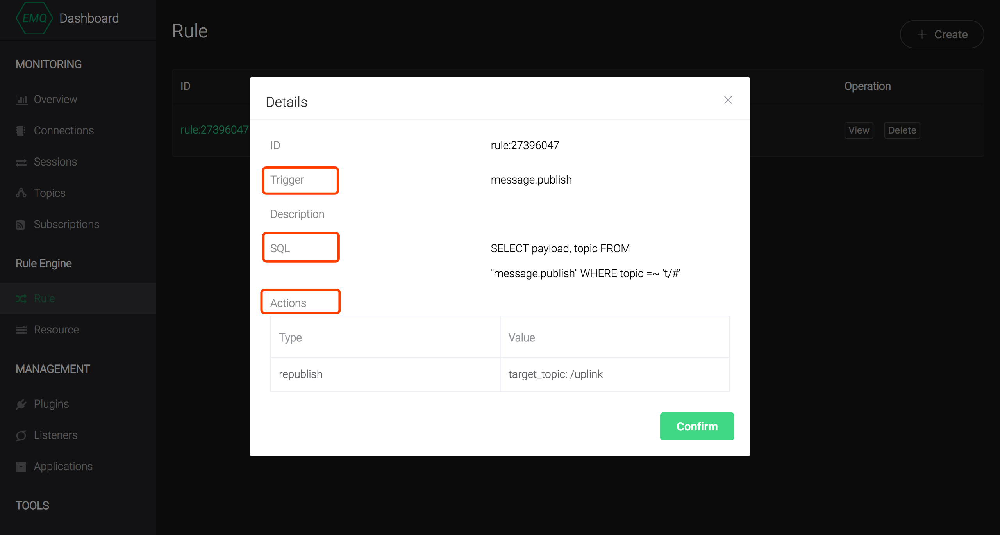

# Overview of Rule Engine 

> Applicable version: **EMQ X v3.1.0+**

> Compatibility tip: The EMQ X v4.0 makes great adjustments to the SQL syntax of the Rule Engine. For v3.x upgrade users, please refer to the [Migration Guide](./ rule_engine.md#migration-guide) for adaptation.

EMQ X Rule Engine (Hereinafter referred to as rule engine) is used to configure the processing and response rules of EMQ X message flows and device events. Rule engine not only provides a clear and flexible "configurable" business integration solution, which is used to simplify the business development process, improve usability, and reduce the coupling degree between the business system and EMQ X, but also provides a better infrastructure for the private function customization of EMQ X to speed up development delivery.


## Introduction

EMQ X will trigger the Rule Engine when the message is published and the event is triggered, and the rules meeting the triggering conditions will execute their respective SQL statements to filter and process the context information of the message and event.

With the Actions, the Rule Engine can store the message processing results of a specified topic to the database, send them to the HTTP Server, forward them to the Kafka or RabbitMQ, and republish them to a new topic or another broker cluster like Azure IoT Hub. Each rule can allocate multiple Actions.

Select the messages published to t/# and select all fields：

```sql
SELECT * FROM "t/#"
```

Select the message published to the t/a topic, and select the "x" field from the message payload in JSON format:

```sql
SELECT payload.x as x FROM "t/a"
```


The Rule Engine uses the virtual topic (Event Topic) starting with $events/ to process the built-in events of EMQ X. the built-in events provide more sophisticated message control and client action processing capabilities, which can be used in the message arrival records of QoS 1 and QoS 2, the device up and down line records and other businesses.

Select the client connected event, filter the device with Username 'emqx' and select the connection information：

```sql
SELECT clientid, connected_at FROM "$events/client_connected" WHERE username = 'emqx'
```

Refer to [SQL manual](./sql.md) for a detailed tutorial on the format of Rule Engine params and SQL statements and the list of [Event Topics](./sql.md#event-topic).

## Minimum rule

The rule describes Three configurations of **where the data comes from, how to filter and process the data, and where the processed results are going. ** One available rule contains three elements:

- Trigger event: The rule is triggered by an event. When triggered, the event injects context information (data source) of the event into the rule, and  the event type is specified through the FROM clause of the SQL;
- Processing rules (SQL): Filter and process data from context information using the SELECT clause and the WHERE clause and built-in handlers;
- Response action: If there is an output of processing result , the rule will perform the corresponding action, such as persistence to the database, republishing the processed message, forwarding the message to the message queue, and so on. A single rule can configure multiple response actions.


As shown in the figure, it is a simple rule for processing the data during the **message release** , filtering out the `msg` field,  message `topic and QoS` of all the topic messages, and sending it to the web. Server and /uplink topics:





## Examples of typical application scenarios for rule engine 

- Action listening: In the development of intelligent door lock for smart home, the function of the door lock will be abnormal because of offline resulting by the network or power failure, man-made damage and other reasons. Through using rule engine configuration to monitor offline events, it can push the fault information to the application service and realize the ability of first time fault detection in the access layer.
- Data filtering: Truck fleet management of vehicle network. Vehicle sensors collect and report a large amount of operational data. The application platform only focuses on data with a vehicle speed greater than 40 km/h. In this scenario, the rule engine can be used to conditionally filter messages to the service, and data that satisfies the condition can be written to the  business message queue .
- Message routing: In the intelligent billing application, the terminal device distinguishes the service type by different topics. The message of billing service can be connected to the billing message queue by configuring the rule engine, and the non-billing information can be connected to other message queues to realize the routing configuration of business messages.
- Message encoding and decoding: In the application scenarios such as public protocol/proprietary TCP protocol access and industrial control, the encoding and decoding of binary/special format message body can be done through the local processing function of the rule engine (which can be customized and developed on EMQ X). Relevant messages can also be routed through the rule engine to external computing resources such as function computing for processing (processing logic can be developed by users), and the messages can be converted into JSON format that is easy for business processing, which simplifies the difficulty of project integration and improves the ability of rapid development and delivery of applications.


## Migration Guide

In version 4.0, the SQL syntax of the rule engine is easier to use. In version 3. X, the event name needs to be specified after the **FROM** clause. After 4.0 version, we introduce the concept of **event topic **. By default, the **message publish** event no longer needs to be specified.

```sql
## 3.x
## Event name needs to be specified for processing
SELECT * FROM "message.publish" WHERE topic ~= 't/#'


## 4.0 and later
## The message.publish event is processed by default, and mqtt topics are filtered directly after FROM
## The above SQL is equivalent to:
SELECT * FROM 't/#'

## Other events are filtered by event topics
SELECT * FROM "$evnents/message_acked" where topic ~= 't/#'
SELECT * FROM "$evnents/client_connected"
```

> The old version of SQL syntax conversion function is provided in Dashboard to complete SQL upgrade and migration.