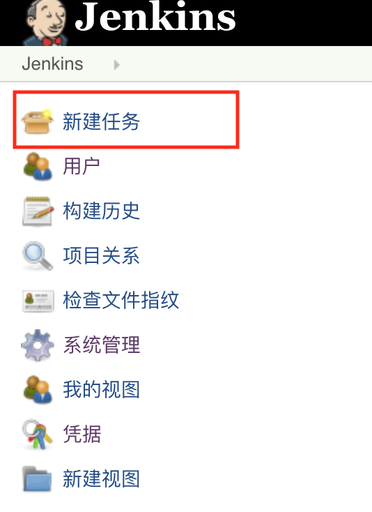
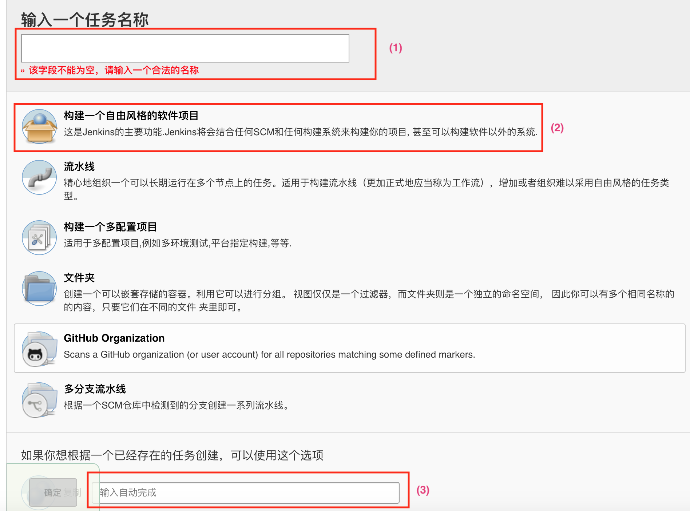
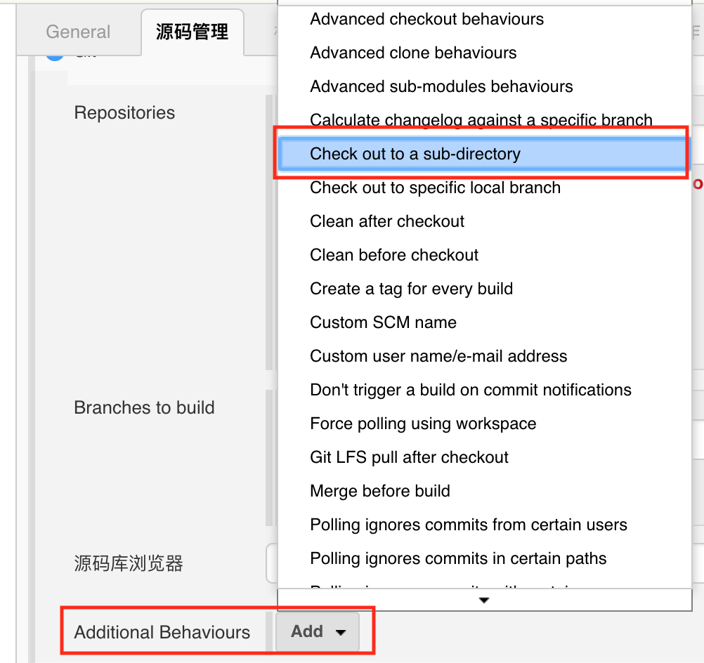
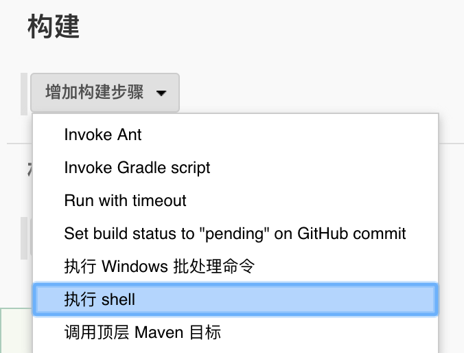

# Jenkins build

## 1. Jenkins登录信息

http://13.125.168.95:8888/

admin:admin

（如果jenkins被关闭，使用ubuntu用户身份执行/opt/jenkins/start.sh启动jenkins，不要用root用户身份执行）

## 2. 创建新任务

（1）输入任务名称

（2）从头开始“构建一个自由风格软件项目”

或者

（3）拷贝现有任务并在其基础上修改

新任务创建后，将在~/.jenkins/workspace目录下自动创建以任务名称命名的文件夹。可以使用jenkins的环境变量${WORKSPACE}直接引用这个文件夹。

### 常用的配置选项：

- General->勾选“**丢弃旧的构建**”：

  设置保留build的天数或最大个数，防止机器被塞爆。

- General->勾选“**参数化构建过程**”：

  自定义参数，允许在build时候修改参数值。引用自定义参数使用以下格式：${<*参数名称*>}

- 源码管理：

  **Git**选项只能拉1个repository的代码。

  **Multiple SCMs**选项可以拉多个repository的代码。

  如无特别说明，代码将下载到任务对应的文件夹下，可预先指定代码存放的子目录：

  

- 构建

  build过程中可以加入shell脚本执行：

  

## 3.Nightly Build说明

### 参数设置

- build时候，指定versionid及type，使其符合当前的版本。
- buildserver指向build出来的文件存放的server，server地址未改变不需要更改。
- buildbase指向buildserver上文件存放的base目录，不需要更改。
- tag如果必须修改，要带"-ci"字符串，以便脚本识别出是在jenkins上做的build
- timeout为build最多执行的时间（单位为分钟），可根据实际情况更改

### Build过程中执行的shell

- 参见https://github.com/emqx/emqx-rel/tree/emqx30/.ci/jenkins_nightlybuild.sh

### Build时间

- 北京时间每天23:00左右自动执行

### Build结果

- http://52.79.226.125:8888/ 可从相应版本及日期目录下面下载