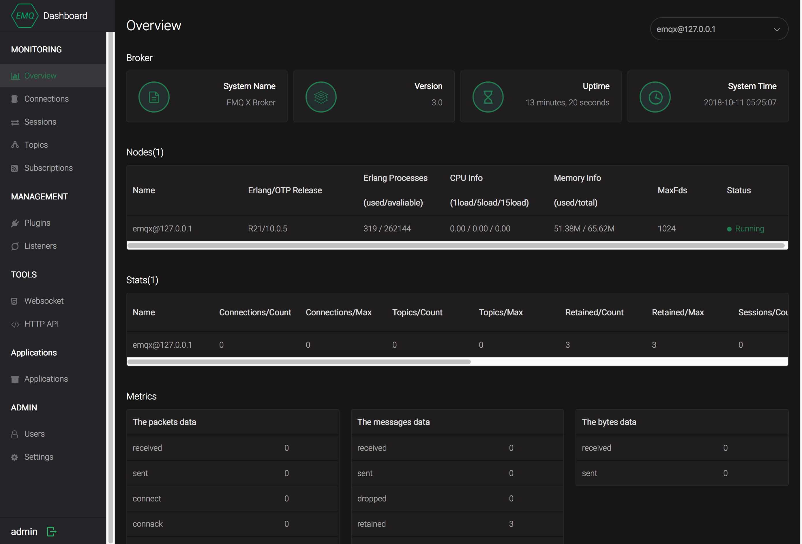
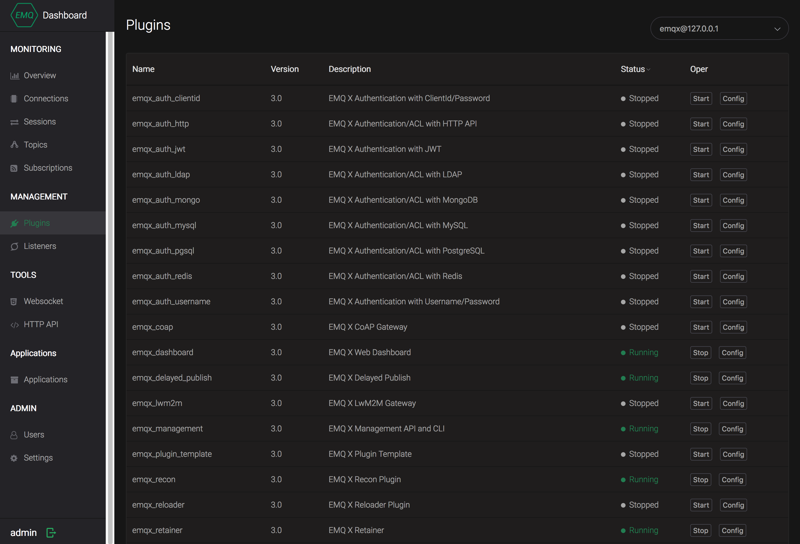

# Run EMQ X for the First Time
After installing the EMQ X, you can run it to get your first experience about it. Besides the command-line console, you can use the Web Dashboard to manage the EMQ X too. The default login name is admin and password is public.

After open this address http://127.0.0.1:18083 in browser, you will the the login page:


After that the username and password is accepted, you can start use the EMQ X Dashboard. The first thing you will see is an overview of EMQ X console. In this page, the system information, nodes information, statistics and etc are showed.


Then you can do your fist configuration on EMQ X to make it fit for your environment and serves your application better.

## Some Elementary configuration on EMQ X

The most configuration can be done by modifying the EMQ X config file. The config files are located at:
- etc/emqx.conf : EMQ X Broker core configuration
- etc/plugins/\*.conf : EMQ X Plugins configuration. Each plugin has its own config file.

Some features and functions can be also configured on EMQ X dashboard.

### Change the Dashboard Interface Language
The Dashboard language can be changed under menu point Admin -> Setting, it applies after you click 'Apply button'. Currently EMQ X supports English and Chinese.


### Change the Default Login Username and Password for Dashboard
Dashboard plugin provides a Web GUI to users to manage the EMQ X broker. It is active after installation by default. You can change the username and password of admin by modifying the config file of dashboard plugin:
Config file:
```bash
etc/plugins/emqx_dashboard.conf
```
Modify the following two lines to chage the username and password:
```
dashboard.default_user.login = admin
dashboard.default_user.password = public
```
Or you can change it on the Web GUI under the menu ADMIN -> Users. You can modify, add, remove users there, the admin user can not be removed.

### Change the Listening Ports
After the installation, following ports are occupied by default:

- 1883: MQTT protocol
- 8883: MQTT/SSL Protocol
- 8083: MQTT/WebSocket Protocol
- 8080: HTTP API
- 18083: Dashboard Interface

You can change these ports if necessary.  

To change the ports for MQTT Protocols, please modify the following three lines in the file 'etc/emqx.conf' and change them the the ports you need.
```
listener.tcp.external = 0.0.0.0:1883

listener.ssl.external = 8883

listener.ws.external = 8083
```
To change the HTTP API port please edit the config file of emqx_management plungin 'etc/plugins/emqx_management.conf', file the following line and modify it:
```
management.listener.http = 8080
```
To change the port of Dashboard console, please file the following line in config file 'etc/plugins/emqx_dashboard.conf':
```
dashboard.listener.http = 18083
```
Under the menu point 'MANAGEMENT -> Listeners' of Web Dashboard, you can check the listening ports in use.的菜单下.


### Start and Stop EMQ X plugins

Plugins are important parts of EMQ X, they extents the features of EMQ X. The Dashboard is also a plugin. You can use the command-line tool 'emqx_ctl' to start and stop the plugins.

Start a Plugin:
```bash
bin/emqx_ctl plugins load plugin_name
```
Stop a Plugin:

```bash
bin/emqx_ctl plugins unload plugin_name
```

Or you can start or stop a plugin using the Dashboard under menu  'MANAGEMENT -> plugins'.


*The dashboard of EMQ X is also implemented as a plugin, if you stop dashboard under Web GUI, you will not be able to use it, until you start it again using the CLI tool.*

### Modify the Erlang VM
EMQ X runs in Erlang VM, in the config file 'etc/emqx.conf' there are two parameters that limits the maximum connection number of EMQ X you may like to adjust:
- node.process_limit : The maximum processes number of the ErlangVM. Each connection needs two processes;
- node.max_ports : the maximum Port number in the Erlang VM. Each EMQ X connection needs one Port.

*The concept of Port in Erlang is different from TCP Port, you can consider a Port is roughly a file handle in Erlang.*

These two parameters can be set to:
- node.process_limit: greater than maximum connection number * 2  
- node.max_ports: greater than maximum connection numbers
