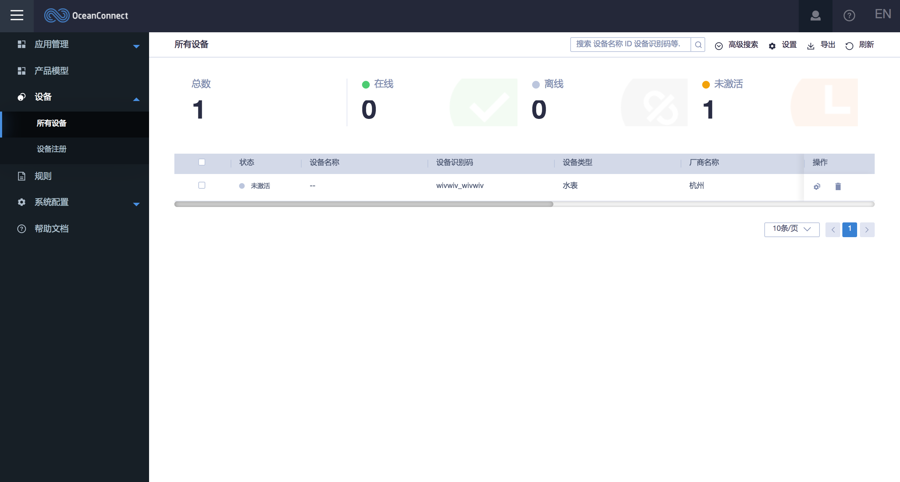

# EMQ X 桥接至云服务

EMQ X 桥接本质是按照规则把消息转发至桥接节点，理论上可以桥接至任意基于 MQTT 协议的服务, 此处选取热门云服务商提供的 MQTT 接入服务进行桥接配置。

## EMQX 到华为云 IoT 平台的桥接

## 场景描述

假设我们有一台 EMQ X 服务器'emqx1'，选用了华为云 IoT 平台作为数据处理平台，我们需要在'emqx1'上创建一条桥接把所有"传感器(sensor)"主题消息转发至华为云，并订阅所有"控制(control)"主题。

**EMQ X**  

| 节点 | 节点名 | 监听端口 |
| :---: | :---: | :---: |
| emqx1 | emqx1@192.168.1.100 | 1883 |

**华为云 IoT 平台**

| 地址 | 监听端口 |
| :---: | :---: |
| iot-acc.huaweicloud.com | 8883 |

### 华为云准备

注册[华为云](https://www.huaweicloud.com)账号并开通**IoT 平台基础版服务**，依次完成产品、设备的创建，创建一个用于接入的设备，设备的接入认证信息如下：

- 接入点：iot-acc.huaweicloud.com:8883
- 认证用户名：创建成功后的设备 ID
- 认证密码：

## AWS IoT Core 桥接
