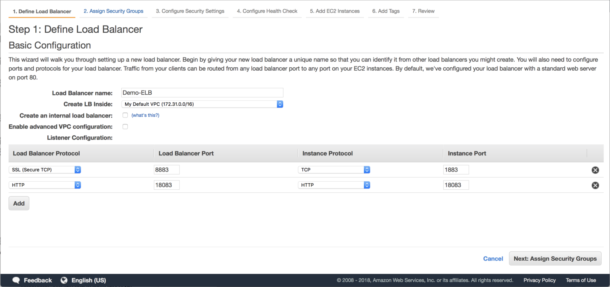
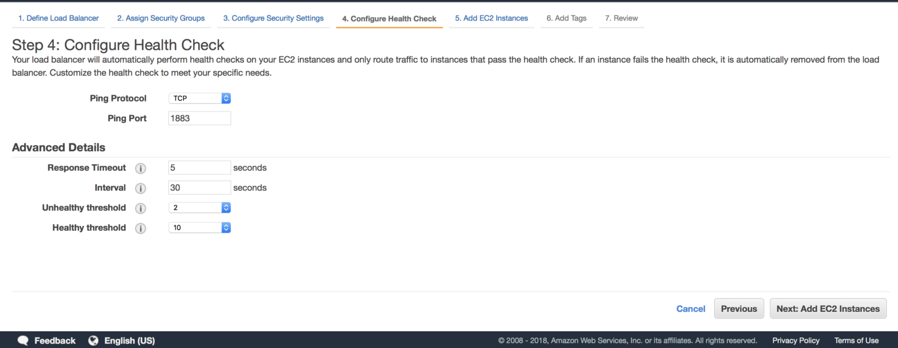
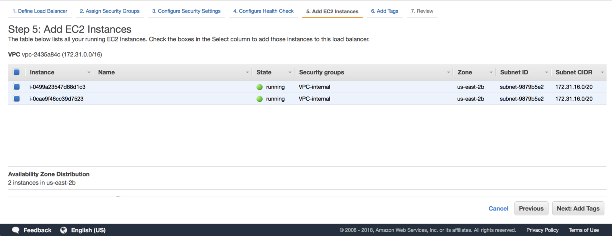
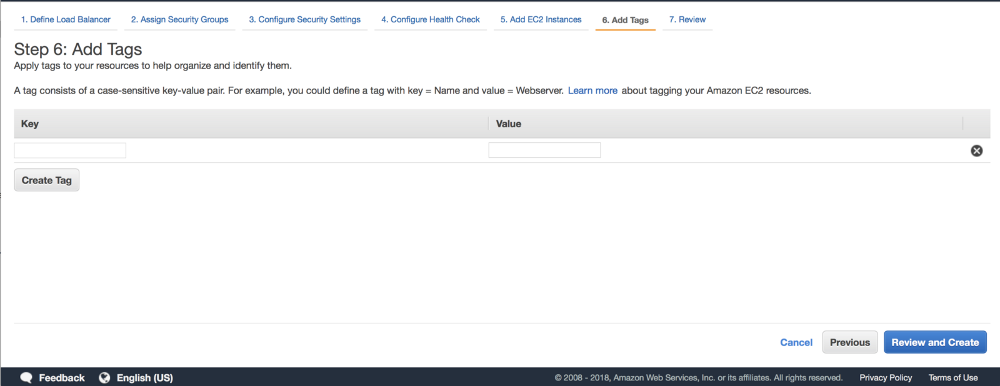

# 为 EMQ X 集群配置负载均衡

## 负载均衡能为 EMQ X 集群带来什么

负载均衡（Load Balancing）的最基本的功能就是均衡多个网络组件的负载，从而优化资源的使用，最小化相应时间，最大化服务能力，避免组件过载而引起的故障。负载均衡技术虽然不是集群中的必备组件，但是能给集群带来一些非常有用的特性，所以它经常会作为集群的一部分部署在系统中。如果我们为 EMQ X 集群部署了负载均衡，我们会得到以下的好处：
- 均衡 EMQ X 服务器的负载。一般在负载均衡器中可以设置不同的均衡算法，如随机、轮排、按权重分配等，使得各 EMQ X 节点都得到有效利用的同时，也不容易出现单节点过载的情况。
- 简化客户端配置。如果没有负载均衡，则客户端必须知道所有 EMQ X 集群节点的地址，否则可能出现当部分节点不在线时，客户端无法连接到集群的情况。而且当集群配置有变化，如节点的增删，也必须修改所有客户端的配置。有了负载均衡，客户端无需关心集群的具体部署，只需要能够连接到负载均衡即可。
- TLS/SSL offload。一般负载均衡都提供SSL截断功能，在负载均衡上终结终结SSL连接，从而减轻 EMQ X 集群的负担，使其可以专注于提供 MQTT 消息服务。同时，在负载均衡上终结 SSL 也能一定程度上降低证书部署和更新的复杂度。
- 提高安全性。 有了负载均衡在集群前端，对外暴露的只有负载均衡的地址和部分服务端口，无法从外部感知到整个服务集群的架构，从而提高了系统的安全性。
- 其他优势。根据所选择的负载均衡设备，部署负载均衡可能会带来其他的附加优势，比如硬件加解密加速，健康检查，流量控制，DDoS抑制等等。

目前可用的负载均衡很多，有开源的，也有商业的，比如HAProxy和NGINX等。各个公有云服务商一般也都会提供各自的负载均衡服务。  
接下来我们以简单的例子介绍一下如何在公有云以及私有部署上使用负载均衡。

## 在AWS 上部署 ELB 负载均衡
Amazon 的 AWS 公有云服务是目前世界范围内最为广泛的公有云服务之一，AWS 也提供了负载均衡： Elastic Load Balancer(ELB)。下面的例子介绍如果为一个两节点的 EMQ X集群配置ELB

### 前置条件
1. 在AWS上配置两台EC2实例，安装 EMQ X 并建立集群。
2. （如需启用TLS/SSL）为ELB生成证书文件。
3. 设立安全组，使 EMQ X 无法被外部直接访问。

以上前置条件的内容超出了本文档的范围，如果您需要更多信息，请访问[AWS网站](https://aws.amazon.com/ec2/developer-resources/).

### 配置 ELB
AWS 提供了3种不同的负载均衡，分别为：Application Load Balancer、Network Load Balancer 和 Classic Load Balancer。MQTT运行在TCP协议上，如需启用SSL连接，我们应该选择Classic Load Balancer。


#### 定义ELB
配置 ELB 的名字，选择 ELB 所在的 VPC，然后添加需要对外的协议和端口即可。比如，客户端通过 SSL 在8883端口访问 MQTT 消息服务，管理员使用 HTTP 在18083端口访问 Web 管理后台。



#### 指定安全组
可以指定现存的安全组，或者新建安全组给ELB，该安全组应该将ELB的服务端口暴露出来。


#### 安全设置

接下来定义ELB如何时候用安全连接。如果不启用SSL，这一步可以跳过。


**选择服务器证书**  
AWS 提供了两种管理证书的方式。一是使用 AWS Certificate Manager (ACM)。ACM 向用户提供证书的 provision 和 storage服务。如果使用ACM生成和管理的的证书，则可以选择ACM选项。二是 AWS Identity and Access Management (IAM)，IAM可以管理您或者第三方生成的证书，前提条件是证书格式是 pem。

**选择 Cipher**  
AWS 提供了一些预定义的安全策略，包含了允许使用的TLS版本，加密算法等。您也可以自定义安全策略，禁用或启用SSL连接的各选项。

#### 配置健康检查

AWS 可以定期的检查后端提供服务的节点是否正常工作。在这里需要指定一个检查端口和协议。



#### 添加AWS EC2 实例

在这个步骤里，用于运行 EMQ X 集群节点的 EC2 实例将会被添加进去。这些实例上都已经配置了安全组，安装并运行了 EMQ X，并且这些 EMQ X 节点已经组成了一个集群。

 

#### 添加标签
如有需要，可以给ELB添加标签。



#### 检查配置
完成以上步骤，ELB差不多就配置完成了，接下来AWS会给出一页配置总结，检查无误后确认完成配置，接下来就可以通过 ELB 访问 EMQ X 集群了。


### 测试配置
我们以 mosquitto 客户端对上面的配置进行一个测试。 在测试中使用SSL进行连接，mosquitto 客户端会使用rootCA检查ELB上发过来的证书。如果要关闭主机名检验，可以在命令行上使用  `--insecure` 参数。

```bash
mosquitto_pub -h Demo-ELB-1969257698.us-east-2.elb.amazonaws.com  -t aa -m bb -d -p 8883 --cafile ~/MyRootCA.pem --insecure

Client mosqpub/1984-emq1 sending CONNECT

Client mosqpub/1984-emq1 received CONNACK

Client mosqpub/1984-emq1 sending PUBLISH (d0, q0, r0, m1, 'aa', ... (2 bytes))

Client mosqpub/1984-emq1 sending DISCONNECT
```
可以看到上例中 mosquitto_pub 可以通过SSL连接到 ELB，ELB 也能把连接路由至后台EMX X 集群并发送消息。

## 使用HAProxy作为负载均衡

在私有部署中，往往需要我们自己建立负载均衡服务器。这里我们以HAProxy为例简单介绍一下如何为私有部署的 EMQ X 配置负载均衡。 如果安装 HAProxy 超出了本文档的范围，需要 HAProxy 的详细说明请访问[HAProxy的网站](http://www.haproxy.org/)

HAProxy的配置文件是`/etc/haproxy/haproxy.cfg`, 根据版本和安装环境的不同可能会有差异。

### 配置HAProxy的后端 （Backend）
后端是指处理HAProxy转发过来的请求的一组服务器。在这里也就是 EMQ X 的集群。在后端配置中，最基本的应该包含以下两项：
- 负载均衡算法，常用的算法有：
 - roundrobin ： 轮流，默认算法
 - leastconn ： 选择连接数最少的后台服务器
 - source ： 按照源地址哈希，可保证同一客户端始终落在同一个后台节点上
- 一组服务器和端口列表

配置例：
```bash
backend emqx_tcp_back
    balance roundrobin
    server emqx_node_1 192.168.1.101:1883 check
    server emqx_node_2 192.168.1.102:1883 check
    server emqx_node_3 192.168.1.103:1883 check

backend emqx_dashboard_back
    balance roundrobin
    server emqx_node_1 192.168.1.101:18083 check
    server emqx_node_2 192.168.1.102:18083 check
    server emqx_node_3 192.168.1.103:18083 check

```
### 配置HAProxy的前端 （Frontend）
前端指定了 HAProxy 在收到请求后如何转发至后端，它定义了接收连接时的地址和端口绑定、一组选项、工作模式以及处理请求的后台。

配置例：
```bash
frontend emqx_tcp
    bind *:1883
    option tcplog
    mode tcp
    default_backend emqx_tcp_back

frontend emqx_dashboard
    bind *:18083
    option tcplog
    mode tcp
    default_backend emqx_dashboard_back
```
### 测试配置
使用mosquitto对以上配置进行测试（test_haproxy.emqx.io 为HAProxy服务器）：
```bash
mosquitto_pub -h test_haproxy.emqx.io  -t aa -m bb -d -p 8883

Client mosqpub/1984-emq1 sending CONNECT

Client mosqpub/1984-emq1 received CONNACK

Client mosqpub/1984-emq1 sending PUBLISH (d0, q0, r0, m1, 'aa', ... (2 bytes))

Client mosqpub/1984-emq1 sending DISCONNECT
```
