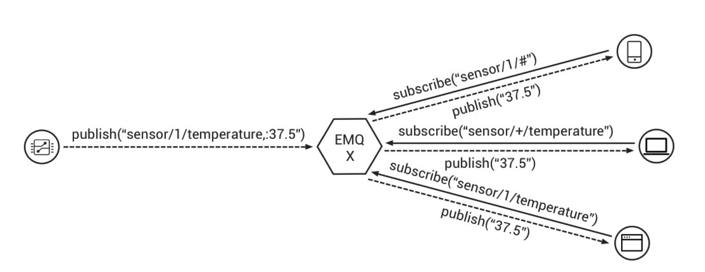

#  什么是 MQTT

MQTT是Message Queuing Telemetry Transport（消息队列遥测传输）的缩写，是IBM开发的一个即时通讯协议，它比较适合于在低带宽、不可靠的网络的进行远程传感器和控制设备通讯等，正在日益成为物联网通信协议的重要组成部分。

- 基于发布/订阅范式的“轻量级”消息协议（头部2字节）
- 专为资源受限的设备、低带宽占用高延时或者不可靠的网络设计，适用于IoT与M2M
- 基于TCP/IP协议栈
- 事实的IoT通讯的标准协议

该协议于1999年由IBM的Dr Andy Stanford-Clark和Arcom(现为Eurotech)的Arlen Nipper提出，协议版本经历了多次升级和改进，于2013年成立OASIS MQTT技术规范委员会，并持续发布协议的新版本，

- 2015年，MQTT3.1.1协议发布
- 2018年，MQTT5.0协议发布

目前主流的支持协议版本为3.1.1，但是比较活跃的MQTT服务器推出了支持MQTT 5.0协议的版本，EMQ X 今年9月份推出了3.0版本，是开源社区中最早支持MQTT 5.0协议的服务器。

## MQTT协议的主要特性

- MQTT 协议使用发布/订阅消息范式来做到一对多的消息分发以及应用程序的解耦 
- MQTT 协议提供了 3 种（QoS）服务质量用于消息传输，适应不同的物联网数据传输场景
  - QoS 0：最多一次传送 (只负责传送，发送过后就不管数据的传送情况) 
  - QoS 1：至少一次传送 (确认数据交付) 
  - QoS 2：正好一次传送 (保证数据交付成功) 
- 通过很小的传输开销，以及最小化的协议交换来减少网络流量 
- 发生异常断线时通知各方的机制 

## MQTT 发布/订阅

如上图所示，

- 发布者：温度传感器，通过主题"sensor/1/temperature"发布一条温度为37.5度的消息
- 3个自上而下的订阅者分别通过订阅不同的主题得到发布者发出的消息
  - 移动设备：通过订阅主题"sensor/1/#"
  - 电脑：通过订阅主题"sensor/+/temperature"
  - 服务器：通过订阅主题"sensor/1/temperature"

## MQTT服务器

MQTT服务器是发布者和订阅者之间通信的代理（因此中文也有将MQTT服务器翻译为MQTT代理），主要提供了以下的功能，

- 基于主题的Pub/Sub模式，将发布者和订阅着解耦
- 对于服务器来说，发布者和订阅者都是“客户端”
- 客户端与服务器连接都通过TCP、TLS或者WebSocket
- 客户端（发布者）发送一条消息到服务器
- 一个或者多个客户端（订阅者）从服务器接收消息

按照MQTT协议标准，服务器提供三种连接方式，

- TCP：默认端口为1883
- TLS：默认端口为8883
- WebSocket：默认端口为8083