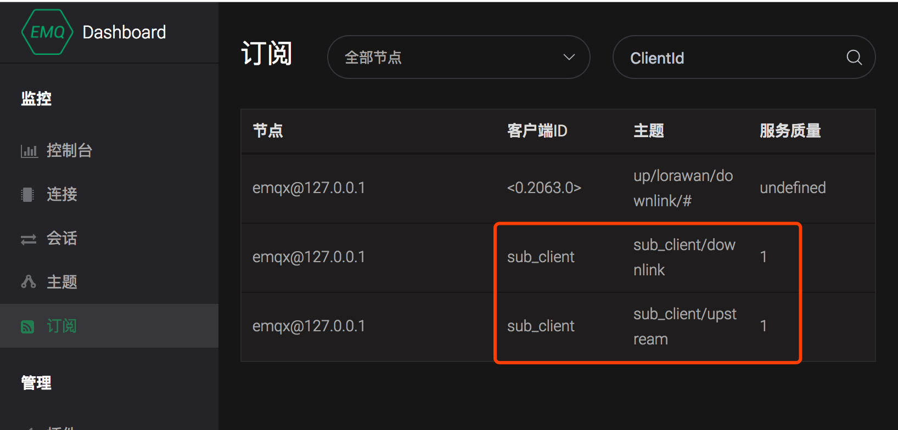

# Redis 数据存储

本章节以在 `CentOS 7.2` 中的实际例子来说明如何通过 Redis 来存储相关的信息。

## 安装与验证 Redis 服务器

读者可以参考 Redis 官方的 [Quick Start](https://redis.io/topics/quickstart) 来安装 Redis（写本文的时候，Redis 版本为5.0），通过 `redis-server` 命令来启动 Redis 服务器。

```bash
# redis-server
20433:C 01 Nov 2018 11:36:30.773 # oO0OoO0OoO0Oo Redis is starting oO0OoO0OoO0Oo
20433:C 01 Nov 2018 11:36:30.773 # Redis version=5.0.0, bits=64, commit=00000000, modified=0, pid=20433, just started
... more logs ...
```

在另外的窗口打开 `redis-cli` 命令，在 `redis-cli` 的交互式命令行窗口中可以通过 `ping` 测试一下 Redis 是否安装成功（返回 'PONG' 表示成功）；通过 `keys *` 命令来查看一下现在 Redis 中有多少存储的值，由于 Redis 首次安装使用，因此返回的是一个空的列表。

```bash
# redis-cli
127.0.0.1:6379> ping
PONG
127.0.0.1:6379> keys *
(empty list or set)
127.0.0.1:6379>
```


## 配置 EMQ X 服务器

通过 RPM 方式安装的 EMQ X，Redis 相关的配置文件位于 `/etc/emqx/plugins/emqx_backend_redis.conf`，如果只是测试 Redis 持久化的功能，大部分配置不需要做更改。唯一需要更改的地方可能是 Redis 服务器的地址：如果读者安装的 Redis 不与 EMQ X 在同一服务器上，请指定正确的 Redis 服务器的地址与端口。如下所示，

```bash
## Redis Server 127.0.0.1:6379, Redis Sentinel: 127.0.0.1:26379
backend.redis.pool1.server = 127.0.0.1:6379
```

保持剩下部分的配置文件不变，然后需要启动该插件。启动插件的方式有 `命令行`和 `控制台`两种方式，读者可以任选其一。

### 通过命令行启动

```bash
emqx_ctl plugins load emqx_backend_redis
```


### 通过管理控制台启动

管理控制台 **插件** 菜单中，找到 **emqx_backend_redis** 插件，点击 **启动**:

 


## 客户端在线状态存储

客户端上下线时，更新在线状态、上下线时间、节点客户端列表至 Redis 数据库。

尽管 EMQ X 本身提供了设备在线状态 API，但在需要频繁获取客户端在线状态、上下线时间的场景下，直接从数据库获取该记录比调用 EMQ X  API 更高效。


### 配置项

打开配置文件，配置 Backend 规则：

```bash
## hook: client.connected、client.disconnected
## action/function: on_client_connected、on_client_disconnected

## 上线
backend.redis.hook.client.connected.1    =  { "action": { "function": "on_client_connected" }, "pool": "pool1"}

## 下线
backend.redis.hook.client.disconnected.1 = {"action": {"function": "on_client_disconnected"}, "pool": "pool1"}
```

### 使用示例

浏览器打开 `http://127.0.0.1:18083` EMQ X 管理控制台，在 **工具** -> **Websocket** 中新建一个客户端连接，指定 clientid 为 sub_client:


打开 `redis-cli` 命令行窗口，执行命令 `keys *`，结果如下所示，读者可以看到在 Redis 中存储了两个 key：

```bash
127.0.0.1:6379> keys *
1) "mqtt:node:emqx@127.0.0.1"
2) "mqtt:client:sub_client"
```


### 连接列表

以 `mqtt:node:{node_name}` 格式的 key 记录节点下客户端列表及连接时间戳信息，等效操作：

```bash
## redis key 为 mqtt:node:{node_name}
HMSET mqtt:node:emqx@127.0.0.1 sub_client 1542272836
```

字段说明：
```bash
## 节点下在线设备信息
127.0.0.1:6379> HGETALL mqtt:node:emqx@127.0.0.1
1) "sub_client1" # clientid
2) "1542272836" # 上线时间
3) "sub_client"
4) "1542272836"
```


### 连接详细信息

以 `mqtt:client:{client_id}` 格式的 key 记录客户端在线状态、上线时间，等效操作：

```bash
## redis key 为 mqtt:client:{client_id}
HMSET mqtt:client:sub_client state 1 online_at 1542272854
```

字段说明：

```bash
## 客户端在线状态
127.0.0.1:6379> HGETALL mqtt:client:sub_client
1) "state"
2) "0" # 0 离线 1 在线
3) "online_at"
4) "1542272854" # 上线时间戳
5) "offline_at"
6) "undefined" # 离线时间戳
```


## 客户端代理订阅

客户端上线时，存储模块直接从数据库读取预设待订阅列表，代理加载订阅主题。在客户端需要通过预定主题通信（接收消息）场景下，应用能从数据层面设定 / 改变代理订阅列表。

### 配置项

打开配置文件，配置 Backend 规则：

```bash
## hook: client.connected
## action/function: on_subscribe_lookup
backend.redis.hook.client.connected.2    = {"action": {"function": "on_subscribe_lookup"}, "pool": "pool1"}
```


### 使用示例

当 `sub_client` 设备上线时，需要为其订阅 `sub_client/upstream` 与 `sub_client/downlink` 两个 QoS 1 的主题：

1. 以 `mqtt:sub:{client_id}` 格式 key 在 Redis 中初始化代理订阅 Hash：

```bash
## redis key 为 mqtt:sub:{client_id}
## HSET key {topic} {qos}
127.0.0.1:6379> HSET mqtt:sub:sub_client sub_client/upstream 1
(integer) 0

127.0.0.1:6379> HSET mqtt:sub:sub_client sub_client/downlink 1
(integer) 0
```

2. EMQ X  管理控制台 **WebSocket** 页面，以 clientid `sub_client`  新建一个客户端连接，切换至**订阅**页面，可见当前客户端自动订阅了 `sub_client/upstream` 与 `sub_client/downlink` 两个 QoS 1 的主题：




3. 切换回管理控制台 **WebSocket** 页面，向 `sub_client/downlink` 主题发布消息，可在消息订阅列表收到发布的消息。


## 持久化发布消息

### 配置项

打开配置文件，配置 Backend 规则，支持使用 `topic` 参数进行消息过滤，此处使用 `#` 通配符存储任意主题消息：

```bash
## hook: message.publish
## action/function: on_message_publish

backend.redis.hook.message.publish.1 = {"topic": "#", "action": {"function": "on_message_publish"}, "pool": "pool1"}
```


### 使用示例

在 EMQ X 管理控制台 **WebSocket** 页面中，使用 clientdi `sub_client` 建立连接，向主题 `upstream_topic` 发布多条消息。针对每条消息， EMQ X 将持久化消息列表、消息详情两条记录。


### 消息列表

EMQ X 将消息列表以 message id 持久化至 `mqtt:msg:{topic}` Redis 集合中：

```bash
## 获取 upstream_topic 主题集合中所有 message id
127.0.0.1:6379> ZRANGE mqtt:msg:upstream_topic 0 -1
1) "2VFsyhDm0cPIQvnY9osj"
2) "2VFszTClyjpVtLDLrn1u"
3) "2VFszozkwkYOcbEy8QN9"
4) "2VFszpEc7DfbEqC97I3g"
5) "2VFszpSzRviADmcOeuXd"
6) "2VFszpm3kvvLkJTcdmGU"
7) "2VFt0kuNrOktefX6m4nP"
127.0.0.1:6379>
```


### 消息详情

每条消息详情将以 `mqtt:msg:{message_id}` 格式的 key 存储在 Redis Hash 中：

```bash
## 获取 message id 为 2VFt0kuNrOktefX6m4nP 的消息详情
127.0.0.1:6379> HGETALL mqtt:msg:2VFt0kuNrOktefX6m4nP
 1) "id"
 2) "2VFt0kuNrOktefX6m4nP" ## message id
 3) "from"
 4) "sub_client" ## client id
 5) "qos"
 6) "2"
 7) "topic"
 8) "up/upstream_topic"
 9) "payload"
10) "{ \"cmd\": \"reboot\" }"
11) "ts"
12) "1542338754" ## pub 时间戳
13) "retain"
14) "false"
```


## 获取离线消息

### 配置项

打开配置文件，配置 Backend 规则：

```bash
## hook: session.subscribed
## action/function: on_message_fetch_for_queue、on_message_fetch_for_pubsub

## 一对一离线消息
backend.redis.hook.session.subscribed.1  = {"topic": "queue/#", "action": {"function": "on_message_fetch_for_queue"}, "pool": "pool1"}

## 一对多离线消息
backend.redis.hook.session.subscribed.2  = {"topic": "pubsub/#", "action": {"function": "on_message_fetch_for_pubsub"}, "pool": "pool1"}

```


### 使用示例

MQTT 离线消息需满足以下条件：

1. 以 clean_session = false 连接
2. 订阅 QoS > 0
3. 发布 QoS > 0

在 EMQ X 管理控制台中以如下配置建立连接，


## 持久化 retain 消息

### 配置项

打开配置文件，配置 Backend 规则：

```bash
## hook: message.publish
## action/function: on_client_connected、on_message_retain

backend.redis.hook.message.publish.2     = {"topic": "#", "action": {"function": "on_message_retain"}, "pool": "pool1"}

backend.redis.hook.message.publish.3     = {"topic": "#", "action": {"function": "on_retain_delete"}, "pool": "pool1"}
```
### 消息列表

EMQ X 将消息列表以 message id 持久化至 `mqtt:retain:{topic}` Redis Hash 中：

```bash
## 获取 upstream_topic 主题集合中所有 message id
127.0.0.1:6379> ZRANGE mqtt:retain:upstream_topic 0 -1
1) "2VFsyhDm0cPIQvnY9osj"
127.0.0.1:6379>
```


### 消息详情

每条消息详情将以 `mqtt:msg:{message_id}` 格式的 key 存储在 Redis Hash 中：

```bash
## 获取 message id 为 2VFt0kuNrOktefX6m4nP 的消息详情
127.0.0.1:6379> HGETALL mqtt:msg:2VFt0kuNrOktefX6m4nP
 1) "id"
 2) "2VFt0kuNrOktefX6m4nP" ## message id
 3) "from"
 4) "sub_client" ## client id
 5) "qos"
 6) "2"
 7) "topic"
 8) "up/upstream_topic"
 9) "payload"
10) "{ \"cmd\": \"reboot\" }"
11) "ts"
12) "1542338754" ## pub 时间戳
13) "retain"
14) "false"
```


## 总结

读者在理解了 Redis 中所存储的数据结构之后，可以利用各种 [Redis 客户端](https://redis.io/clients)来实现对相关信息的读取，
